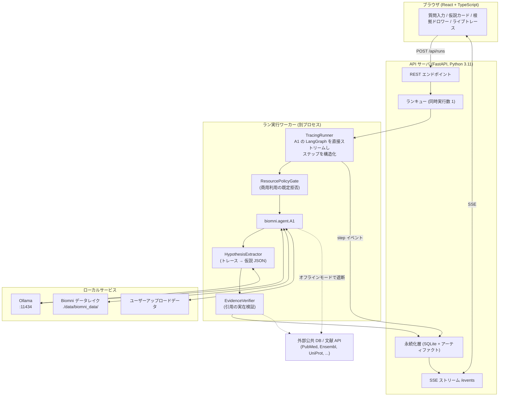
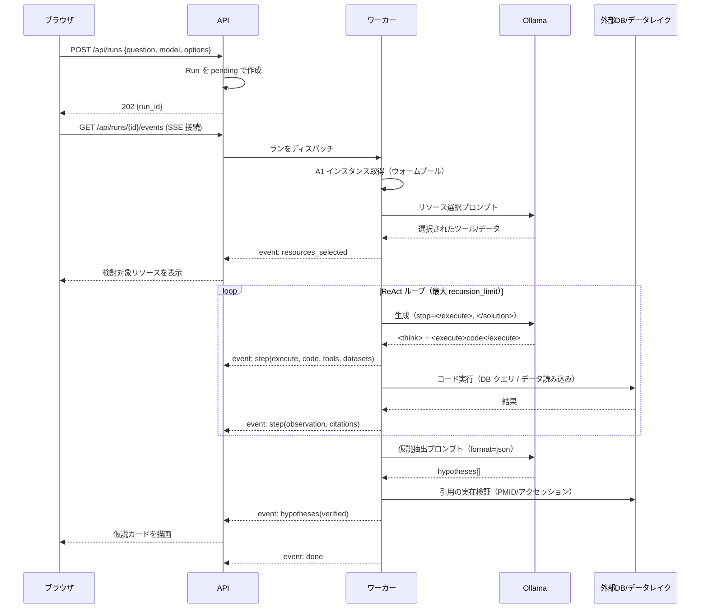

# 02. アーキテクチャ

## 2.1 全体構成



## 2.2 技術選定

| レイヤ | 採用 | 理由 |
| --- | --- | --- |
| バックエンド | FastAPI + Uvicorn | Biomni が Python 製。同一言語で直接埋め込める。SSE が素直に書ける |
| ワーカー | `multiprocessing` の別プロセス（v1）→ Celery + Redis（将来） | A1 の実行は完全同期・ブロッキング。イベントループを塞がないため分離必須 |
| DB | SQLite + SQLModel | 単一ユーザーのローカル運用。移行時は Postgres に差し替え可能な ORM を使う |
| フロント | React + TypeScript + Vite + TanStack Query | SSE と部分更新の相性、型付き API クライアント |
| スタイル | Tailwind CSS | 実装速度優先 |
| LLM | Ollama（`langchain-ollama` の `ChatOllama`） | ローカル完結・API キー不要。§04 に統合詳細 |
| 実行隔離 | Docker Compose（api / worker / ollama） | LLM が生成した任意コードを実行するため（§2.6） |

### なぜ Biomni 標準の Gradio デモを使わないか

`A1.launch_gradio_demo()` は存在するが、(1) 出力が整形済みテキストのみで根拠を構造化できない、
(2) ラン履歴・仮説の永続化が無い、(3) `go_stream()` が `{"output": <整形済み文字列>}` しか
yield しないため機械可読なトレースが取れない。本アプリの主目的（根拠提示）を満たせないため自前 UI とする。

## 2.3 コンポーネント責務

### `TracingRunner` — 実行と構造化（本アプリの心臓部）

`A1.go()` / `A1.go_stream()` は使わず、**A1 が内部に持つ LangGraph アプリを直接ストリームする**。
`go_stream()` は `pretty_print()` を通した文字列しか返さないため、根拠抽出に必要な情報（生コード・
生 observation・メッセージ種別）が失われるため。

```python
# 疑似コード: worker/tracing_runner.py
class TracingRunner:
    def run(self, agent: A1, question: str) -> Iterator[StepEvent]:
        # 1) リソース選択フェーズ: 「何を検討したか」を記録する
        selected = agent._prepare_resources_for_retrieval(question)   # dict: tools/data_lake/libraries/know_how
        agent.update_system_prompt_with_selected_resources(selected)
        yield StepEvent(type="resources_selected", payload=selected)

        # 2) ReAct ループを直接回す
        inputs = {"messages": [HumanMessage(content=question)], "next_step": None}
        cfg = {"recursion_limit": 500, "configurable": {"thread_id": self.run_id}}
        for state in agent.app.stream(inputs, stream_mode="values", config=cfg):
            msg = state["messages"][-1]
            yield from self._classify(msg, agent)   # think / execute / observation / solution に分解

    def _classify(self, msg, agent):
        text = msg.content
        if m := re.search(r"<execute>(.*?)</execute>", text, re.DOTALL):
            code = m.group(1)
            yield StepEvent(
                type="execute",
                code=code,
                tools=agent._parse_tool_calls_with_modules(code),   # [(func_name, module), ...]
                datasets=self._match_data_lake(code, agent.data_lake_dict),
                user_files=self._match_user_files(code),
            )
        elif m := re.search(r"<observation>(.*?)</observation>", text, re.DOTALL):
            yield StepEvent(type="observation", text=m.group(1),
                            citations=extract_citations(m.group(1)))  # PMID/DOI/アクセッションを抽出
        elif m := re.search(r"<solution>(.*?)</solution>", text, re.DOTALL):
            yield StepEvent(type="solution", text=m.group(1))
        else:
            yield StepEvent(type="think", text=text)
```

ここで得られる情報が、そのまま §03 の根拠モデルの原材料になる：

| 取得元 | 得られる根拠情報 |
| --- | --- |
| `_prepare_resources_for_retrieval()` の戻り値 | エージェントが**検討対象にした**ツール・データセット・ライブラリ・ノウハウ文書 |
| `<execute>` 内のコード | 実際に**使ったデータファイル名・関数・パラメータ**（`agent.data_lake_dict` のキーと突き合わせ） |
| `agent._parse_tool_calls_with_modules(code)` | 呼び出された Biomni ツールと所属モジュール |
| `<observation>` の出力 | DB のレコード実体、統計量、PMID / DOI / アクセッション |
| `agent._execution_results[i]["images"]` | 実行中に生成された図（base64） |

### `HypothesisExtractor` — トレース → 構造化仮説

A1 の最終 `<solution>` は自然文。これを**そのまま信用せず**、トレース全体（ステップ要約＋
収集済み根拠候補リスト）を入力に、別プロンプトで JSON を生成させる。詳細は §03.3。

A1 のループを通さず `ChatOllama` を直接呼ぶ。理由：A1 のシステムプロンプトは
コード実行を強制する巨大なもので、素直な JSON 出力に向かないため。

### `ResourcePolicyGate` — 商用利用の強制

`config/resource_policy.yaml` を唯一の情報源に、データセット・ツール・ライブラリ・モデルを
既定拒否で絞る。A1 構築時（ツールレジストリのフィルタ）と `<execute>` 実行直前（コードの静的検査）の
2 点で効かせる。詳細は §05.2。

Biomni の `commercial_mode=True` はデータセットとライブラリとノウハウ文書しか絞らず、
**ツールは絞らない**（KEGG など商用ライセンスが要る API を叩くツールが残る）ため、
このレイヤは Biomni の機能では代替できない。

### `EvidenceVerifier` — 引用の実在検証

抽出された引用を機械的に検証し、通らなかったものは仮説から外す（§03.4）。
**この工程が無いとローカル LLM は PMID を平気で捏造する。** 本アプリの信頼性の要。

## 2.4 実行シーケンス



## 2.5 A1 のライフサイクル管理（重要な制約）

`A1` は**重く・ステートフル**であり、扱いを間違えると実用にならない。

| 制約 | 内容 | 対策 |
| --- | --- | --- |
| 初期化が重い | `A1.__init__` はデータレイクを S3 から一括ダウンロードする（`expected_data_lake_files=None` の場合、`env_desc.py` に列挙された全ファイル） | **`expected_data_lake_files` にポリシー許可済みファイルのリストを明示的に渡す**（`[]` でスキップ）。初回セットアップ時のみ CLI で個別取得 |
| モードが構築時に固定される | `commercial_mode` はコンストラクタでしか渡せず、`env_desc` / `env_desc_cm` の選択と know-how のフィルタが `__init__` で確定する | 本アプリは**常に `commercial_mode=True`** で構築する。ラン単位の切り替えは提供しない（§05） |
| ステートフル | `self.log` / `self._execution_results` / `self._conversation_state` をインスタンスに溜める。`thread_id` は `go()` 内で 42 固定 | **1 ラン = 1 A1 インスタンス**。ラン開始時にリセットするか、プロセスごと使い捨てる |
| Python REPL がグローバル | `run_python_repl` は共有名前空間で `exec` する。前のランの変数が残る | ラン間でワーカープロセスを再起動する（v1）／将来はランごとに専用 REPL |
| 同期ブロッキング | `go()` は完了までブロックする | ワーカーを別プロセスに分離。API は非同期のまま |

**v1 の方針**: ワーカープロセスを 1 本立て、ランを 1 件ずつ直列処理する。
起動時に A1 を 1 インスタンス作って温めておき（`ToolRegistry` 構築とノウハウ文書ロードのコストを償却）、
ラン開始ごとに `agent.log = []; agent._execution_results = []` でリセットする。
N ラン（既定 20）ごとにワーカーを再起動して REPL の状態汚染をリセットする。

## 2.6 コード実行の隔離（必須）

Biomni の `run_python_repl` / `run_bash_script` は **LLM が生成した任意のコードをサンドボックスなしで実行する**。
ローカル運用でも以下は必須とする。

- ワーカーを専用 Docker コンテナで動かす。ホストのファイルシステムはマウントしない（データレイクとアップロード領域のみボリュームで渡す）
- 非 root ユーザーで実行、`--cap-drop=ALL`、書き込み可能領域をワークスペースに限定
- `timeout_seconds`（既定 600）を必ず設定。UI からも上限を設けられるようにする
- **オフラインモード**: コンテナの外向き通信を Ollama のみに制限する Docker network を用意。公共 DB を使わない代わりに、質問文が一切外部に出ないことを保証する
- リソース上限（`--memory`, `--pids-limit`）を設定し、暴走コードでホストを巻き込まない

## 2.7 ディレクトリ構成（案）

```
biomni_local01/
├── docs/design/              # 本設計書
├── backend/
│   ├── app/
│   │   ├── main.py           # FastAPI エントリ
│   │   ├── api/              # ルータ (runs, models, datasets, reports)
│   │   ├── models/           # SQLModel 定義 (Run, Step, Hypothesis, Evidence, Resource)
│   │   ├── store/            # 永続化・アーティファクト管理
│   │   └── events.py         # SSE ブローカ
│   ├── worker/
│   │   ├── main.py           # ワーカーループ
│   │   ├── agent_factory.py  # A1 生成 + Ollama 差し替え（§04）
│   │   ├── tracing_runner.py # トレース構造化
│   │   ├── extractor.py      # 仮説抽出
│   │   ├── verifier.py       # 引用検証
│   │   └── citations.py      # 識別子の抽出パターン
│   └── tests/
├── frontend/
│   ├── src/
│   │   ├── pages/            # RunNew, RunDetail, RunHistory
│   │   ├── components/       # HypothesisCard, EvidenceDrawer, TraceTimeline
│   │   └── api/              # 型付きクライアント + SSE フック
├── data/                     # Biomni データレイク（.gitignore）
├── workspace/                # ラン成果物（図・CSV・レポート、.gitignore）
├── docker-compose.yml
└── .env.example
```
