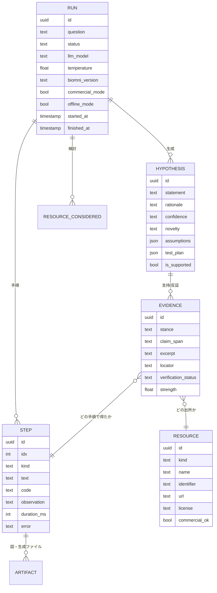

# 03. 根拠モデル — 「使ったデータと、その根拠」をどう表現するか

本アプリの中核。**仮説は必ず根拠に接続され、根拠は必ず実行トレース上の位置に接続される。**

## 3.1 データモデル



### `Resource.kind` の種別

| kind | 例 | 取得元 |
| --- | --- | --- |
| `dataset` | `DepMap_CRISPRGeneEffect.csv`, `gwas_catalog.pkl` | データレイク。`agent.data_lake_dict` に説明とライセンスを持つ |
| `user_file` | `my_rnaseq_deg.csv` | ユーザーアップロード |
| `tool` | `query_opentarget`, `query_stringdb` | `agent._parse_tool_calls_with_modules(code)` |
| `library` | `scanpy`, `gseapy` | `agent.library_content_dict` |
| `literature` | PMID:38412345, DOI:10.1038/... | observation からの抽出 |
| `db_record` | UniProt:P04637, Ensembl:ENSG00000141510 | observation からの抽出 |
| `computation` | ラン内で実行した統計解析そのもの | Step 自体を Resource 化 |
| `know_how` | Biomni 同梱のプロトコル文書 | `know_how_loader` |

### `Evidence.stance`

`supports` / `refutes` / `context`。**反証根拠を捨てない**のが設計上の意図的な選択。
仮説カードには反証も併記し、研究者が判断できるようにする。

### `Evidence.verification_status`

`verified` / `unverified` / `failed` / `not_applicable`。§3.4 で決まる。
**`failed` の根拠は仮説から切り離し、「検証に失敗した引用」として別枠に隔離表示する。**

## 3.2 3 段階の「使用データ」

UI では以下を区別して見せる。混ぜると「本当に使ったのか」が分からなくなる。

| 段階 | 意味 | 取得方法 |
| --- | --- | --- |
| **A. 検討対象** | エージェントがこのクエリに関連ありと判断したリソース | `_prepare_resources_for_retrieval()` の戻り値 |
| **B. 実際に触れた** | コード中で実際に読み込み・呼び出しされたリソース | `<execute>` のコード解析 + observation |
| **C. 主張を支えた** | ある仮説の根拠として引かれたリソース | 抽出フェーズで仮説に紐付いたもの |

C ⊆ B ⊆ A が成り立つべきで、成り立たない場合（C にあって B に無い＝**コードで触れていないのに引用された**）は
幻覚のシグナルとして扱い、`verification_status = failed` にする。この包含チェックは §3.4 の検証の 1 つ。

## 3.3 仮説の抽出（Extractor）

### なぜ最終回答をそのまま使わないか

A1 の `<solution>` は自然文で、根拠の粒度がバラバラ。ローカル LLM では特に、
「PMID 12345678 によれば」のような**トレース上に存在しない引用**が混ざる。
そこで、**トレースに実在する根拠候補だけを選択肢として与え、そこから選ばせる**方式を取る。

### 入力（Extractor プロンプトに渡すもの）

```jsonc
{
  "question": "...",
  "solution_text": "A1 の <solution> 全文",
  "steps": [
    {"idx": 3, "kind": "execute", "summary": "gwas_catalog.pkl を読み、乳がん関連 SNP を抽出",
     "tools": ["query_gwas_catalog"], "datasets": ["gwas_catalog.pkl"]},
    {"idx": 4, "kind": "observation", "excerpt": "rs2981582 ... FGFR2 ... p=2e-76 ..."}
  ],
  "evidence_candidates": [        // トレースから機械抽出済み。ID でしか参照できない
    {"eid": "E1", "kind": "db_record", "identifier": "rs2981582", "step_idx": 4, "excerpt": "..."},
    {"eid": "E2", "kind": "literature", "identifier": "PMID:17529967", "step_idx": 6, "excerpt": "..."}
  ]
}
```

### 出力スキーマ（厳格）

```jsonc
{
  "hypotheses": [
    {
      "statement": "検証可能な 1 文。主語・関係・条件を含むこと",
      "rationale": "なぜそう言えるか。2〜4 文",
      "confidence": "high | medium | low",
      "novelty": "established | emerging | speculative",
      "evidence": [
        {"eid": "E1", "stance": "supports",
         "claim_span": "statement 内の、この根拠が支える部分",
         "why": "この根拠がなぜその主張を支えるのか（1 文）"}
      ],
      "assumptions": ["前提 1", "前提 2"],
      "test_plan": {
        "experiment": "例: MCF7 で FGFR2 を CRISPRi ノックダウン",
        "readout": "例: 増殖率と下流 ERK リン酸化",
        "controls": ["非標的 sgRNA", "..."],
        "feasibility": "high | medium | low",
        "estimated_effort": "例: 3 週間 / 標準的な細胞培養設備"
      }
    }
  ]
}
```

**制約（プロンプトとバリデータの両方で強制）**

1. `evidence[].eid` は**入力の `evidence_candidates` に存在する ID のみ**。未知の ID を含む仮説は破棄して 1 回だけ再生成。
2. `evidence` が空の仮説は `is_supported = false` として保持し、UI で「未裏付けの着想」セクションに分離。捨てはしない（研究の種としては価値があるため）。
3. `statement` に PMID / 遺伝子 ID を直書きさせない。識別子は `evidence` 経由でのみ表現する。
4. JSON パースに失敗した場合は、`format: json`（Ollama）で 2 回まで再試行し、それでも駄目なら
   自然文の solution をそのまま「未構造化の結論」として保存する（**ラン全体を失敗にしない**）。

### 実装メモ

Ollama は OpenAI 互換の JSON Schema 構造化出力に対応している。`ChatOllama(format=<json schema>)` で
スキーマを直接強制するのが第一選択。小さいモデルでスキーマ準拠が崩れる場合は
「1 仮説ずつ生成させる」ループに分解する（1 回の出力を小さくすると成功率が上がる）。

## 3.4 根拠の検証（Verifier）

抽出された根拠を、**LLM を介さず機械的に**検証する。

| 根拠種別 | 検証方法 | `failed` の扱い |
| --- | --- | --- |
| `literature` (PMID) | NCBI E-utilities `esummary` で存在確認。タイトルを取得して保存 | 引用を除去、仮説に「引用が確認できません」バッジ |
| `literature` (DOI) | `doi.org` への HEAD リクエスト（オフラインモードではスキップ→`not_applicable`） | 同上 |
| `db_record` | 該当 observation テキスト中に識別子が**実在するか**を文字列一致で確認（一次検証）。オンライン時は該当 DB に問い合わせて二次検証 | 除去 |
| `dataset` / `user_file` | ファイルがワークスペースに存在し、かつ `<execute>` のコードに名前が現れるか | 除去 |
| `computation` | 対応する Step が存在し `error` が無いか | 除去 |
| 全種別共通 | **包含チェック**: C ⊆ B（§3.2）。トレースに現れないリソースは無条件で `failed` | 除去 |

`excerpt` は必ず observation の**実テキストから切り出す**（LLM に書かせない）。
identifier の出現位置の前後 N 文字を取る。これで「根拠の引用文だけ捏造される」ケースを潰す。

### 検証結果のラン単位サマリ

レポートとランサマリに以下を必ず出す。品質の可視化そのものが機能。

```
根拠 42 件中: 検証済 35 / 検証不能 4（オフライン） / 検証失敗 3
仮説 7 件中: 裏付けあり 6 / 未裏付け 1
```

## 3.5 識別子の抽出パターン（`citations.py`）

observation テキストから正規表現で拾う。過検出は検証フェーズで落ちるので、拾いは広めでよい。

| 種別 | パターン（概略） | 例 |
| --- | --- | --- |
| PMID | `\bPMID:?\s*(\d{7,8})\b`, `pubmed.ncbi.nlm.nih.gov/(\d+)` | PMID: 17529967 |
| DOI | `\b10\.\d{4,9}/[-._;()/:A-Za-z0-9]+\b` | 10.1038/nature12873 |
| Ensembl | `\bENS[A-Z]*[GTP]\d{11}\b` | ENSG00000141510 |
| UniProt | `\b[OPQ][0-9][A-Z0-9]{3}[0-9]\|[A-NR-Z][0-9]([A-Z][A-Z0-9]{2}[0-9]){1,2}\b` | P04637 |
| dbSNP | `\brs\d{2,}\b` | rs2981582 |
| HGNC 記号 | 既知の遺伝子記号辞書との突き合わせ（`gene_info.parquet`） | FGFR2 |
| GEO | `\bGSE\d+\b`, `\bGSM\d+\b` | GSE12345 |
| ClinVar | `\bVCV\d+\b`, `\bRCV\d+\b` | VCV000012345 |
| PDB | `\b[1-9][A-Za-z0-9]{3}\b`（誤検出多、PDB ツール使用時のみ有効化） | 6XYZ |
| ChEMBL | `\bCHEMBL\d+\b` | CHEMBL25 |
| Reactome | `\bR-HSA-\d+\b` | R-HSA-109582 |

**ゲート**: 各パターンは「該当ツールがそのステップで呼ばれていたか」で有効化を絞る。
例えば PDB の 4 文字パターンは `query_pdb` を呼んだステップの observation でのみ適用する。

## 3.6 レポート出力

- **Markdown**: 質問 / 設定（モデル・モード・Biomni バージョン）/ 仮説と根拠 / 実行トレース全文（コード＋出力）/ 引用一覧＋検証状況 / 使用データのライセンス一覧
- **JSON**: 上記のデータモデルをそのままシリアライズしたもの。他ツールへの引き渡し用
- **図**: `agent._execution_results[i]["images"]`（base64）をファイル化して埋め込む

レポートには**必ずライセンス表記セクションを含める**（§05）。CC BY 系のデータは帰属表示が義務。
